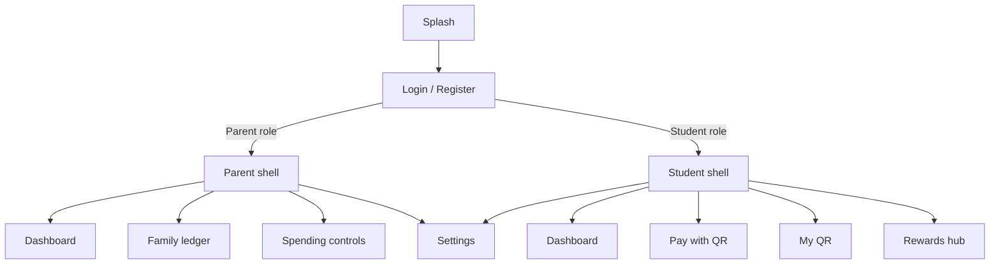

# HapoPay — Meeting Progress Brief

**Prepared:** 30 September 2026  
**Product:** HapoPay Flutter (parent–student smart spending)  
**Target:** v1.0.0 store release  
**Stack:** Flutter · Riverpod · GoRouter · Dio · Django REST · optional Supabase Realtime

> This document replaces the earlier July progress snapshot. It covers **what the app does today**, **what shipped recently**, and **production phases (including Phase 3)**.

---

## 1. What HapoPay does (product functionality)

HapoPay is a **role-based family money app**:

| Role | Core jobs |
|------|-----------|
| **Parent** | Oversee family balance, set / freeze child spending limits, review the family ledger, get alerts |
| **Student** | See allowance balance, pay / receive via QR, track savings goals, earn gamified rewards |

### End-to-end flows (implemented in the client)



**How data works today**

- **Mock mode** (`USE_MOCK_API=true` in `.env.dev`): in-app `MockInterceptor` serves parent/student/rewards/payment fixtures — demos without Django.
- **Live mode** (`USE_MOCK_API=false`): Dio calls Django (`/accounts/`, `/parent/`, `/rewards/`, payments). JWT tokens go in secure storage; auth interceptor refreshes on 401.
- **Realtime (optional):** `SupabaseRealtimeService` can subscribe to `public:transactions` when `SUPABASE_URL` is set.
- **Release safety:** `EnvConfig.assertReleaseSafe` blocks mock API / localhost in release builds.

---

## 2. Feature status — functionality, not just UI labels

| Area | What works | Status |
|------|------------|--------|
| **Auth — Login** | Role tabs (Parent / Student), email/password UI, direct role navigation for UI demos; full JWT path (login → secure storage → role redirect) exists but is currently **commented** for UI testing | UI ready · API path present · re-enable for prod |
| **Auth — Register** | Multi-step registration UI (role cards, validation helpers) | UI ready · wire to live register endpoint |
| **Auth — Biometrics** | `local_auth` + PIN fallback screens; Android/iOS Face ID / fingerprint permissions | Integrated on Pay QR / PIN flows · login unlock polish remaining |
| **Parent dashboard** | Family balance hero, children list, spend donut categories, recent txns, alert banner, deep links to ledger / limits | Feature-complete on client (mock + API contract) |
| **Family ledger** | Grouped transaction activity, child/status filters, in/out totals | Feature-complete on client |
| **Spending controls** | Daily/weekly limit slider, **card lock** (freeze), save via account provider → `PATCH`-style update | Feature-complete on client |
| **Student dashboard** | Balance hero, Pay QR / My QR / quick actions, rewards summary, savings goals, recent activity | Feature-complete on client |
| **Pay QR** | Multi-step pay flow (amount → biometric/PIN → timed QR), security badge, countdown | Client complete · merchant handshake depends on live Django |
| **My QR** | Dynamic QR generation for receive / allowance (`qr_flutter`), amount + description | Client complete |
| **Rewards** | Tier ladder, streak panel, achievement grid, optimistic claim + rollback | Client complete · Django `/api/rewards/` must stay catalog-aligned |
| **Settings** | Profile card, theme (light / dark / system), toggles, package version, logout | Feature-complete |
| **Theme system** | Material 3 tokens (`AppTokens`), Outfit font, light **and** dark, theme toggle in shell | Done |
| **App shell** | Bottom nav scaffold by role, shared header / logo, route isolation (parent ↛ student routes) | Done |
| **Networking** | Dio client, auth + retry + mock interceptors, OpenAPI / Postman collection | Done |
| **CI / release tooling** | Analyze, tests, debug builds; release AAB workflow; version bump tool; Sentry (optional DSN) | Phases 1 & 5 largely done |
| **Store assets / legal hosting** | Listing copy + data-safety *drafts* exist | **Phase 3–4 still open** (see §4) |

**Overall client readiness for demo / internal QA:** high  
**Overall store-submission readiness:** Phase 3 (assets) + Phase 4 (hosted legal) + iOS signing + real `.env.prod` still block submission

---

## 3. Recent updates (what we shipped)

Grouped from Sept 2026 work on `main` (highlights):

### Product & UX
- Parent portal: dashboard, family ledger, spending limits / card lock, children + spend charts
- Student hub: dashboard, rewards (tiers / streaks / claim), Pay QR + My QR
- Settings + light/dark theme (tokens, toggle, dark-mode CI coverage)
- Biometric / Face ID permissions and Pay-flow PIN / biometric auth UI
- Role-based shells; routes closed so students/parents cannot open each other’s areas

### Platform & API contract
- Flutter ↔ Django contract clarified (`docs/api-reference.md`, OpenAPI, Postman collection)
- Mock API catalog for offline demos (`USE_MOCK_API`)
- Env injection via `--dart-define-from-file` (`.env.dev` / `.env.prod`)
- Android identity `com.hapopay.hapoPay` + release signing via `key.properties` / upload keystore
- Sentry integration (skipped when DSN empty)
- Release CI (AAB + unsigned iOS artifacts) + `tool/bump_version.dart`
- Store listing / content-rating / Play Data safety **drafts** + privacy/ToS **checklists**

### Engineering hygiene
- Riverpod providers across parent / student / QR / settings / auth
- Logger instead of raw prints; package_info for version display
- CI/CD pipeline fixes (analyze, tests, iOS build workflow)

---

## 4. What we still need to achieve

### Production runbook (authoritative)

Source: [`docs/PROD_NEXT_STEPS.md`](docs/PROD_NEXT_STEPS.md)

| Phase | Focus | Status |
|-------|--------|--------|
| **1 — Identity & signing** | Android app id + keystore signing | **Done** (iOS Team / certs still owner) |
| **2 — Production environment** | Real `.env.prod`, mock off, Supabase replication, Django CORS | **In progress / owner** |
| **3 — Store assets** | Icons, splash, feature graphic, store screenshots, real image assets | **Next major milestone** ↓ |
| **4 — Legal & listings** | Host Privacy + Terms URLs; paste console forms | Drafts done · hosting open |
| **5 — Monitoring & release CI** | Sentry + release workflow + version bump | **Done** |
| **6 — Device QA** | Physical-device checklist before submit | Pending after 2–4 |

### Phase 3 — Store assets (detail)

This is the **next shared milestone** to call out in the meeting:

- [ ] Branded **Android adaptive icons** + **iOS AppIcon** (1024×1024 source)
- [ ] **Splash / launch** screens (Android `launch_background`, iOS LaunchScreen)
- [ ] Play Store **feature graphic** (1024×500)
- [ ] App Store / Play **device screenshots** (6.7", 6.5", 5.5", iPad Pro as needed)
- [ ] Replace `.gitkeep` placeholders under `assets/images/` and `assets/icons/` with real branding art
- [ ] Confirm `pubspec.yaml` asset paths for anything new

Why it matters: without Phase 3, we cannot present a credible store listing even if the app binary builds.

### Also needed for a real launch (outside Phase 3)

1. **Re-enable live auth** — uncomment JWT login/register + GoRouter auth redirects (currently bypassed for UI testing).
2. **iOS signing** — Apple Developer enrollment, distribution cert, provisioning, `DEVELOPMENT_TEAM`.
3. **Prod env** — fill `.env.prod` (`API_BASE_URL`, Supabase, `USE_MOCK_API=false`, Sentry).
4. **Backend parity** — rewards catalog + payment process endpoints matching the Flutter contract.
5. **Hosted Privacy Policy & Terms** URLs (Phase 4).
6. **Device QA** (Phase 6) on physical Android/iOS.
7. **Post-launch:** push notifications, deeper tests, budget charts, deep links (see [`PRODUCTION_READINESS.md`](PRODUCTION_READINESS.md)).

### Product milestones (feature roadmap)

From [`docs/NEXT_STEPS.md`](docs/NEXT_STEPS.md) — useful if the meeting mixes “features” with “store phases”:

| Milestone | Intent | Notes |
|-----------|--------|-------|
| M1 Auth & session | Django JWT + secure storage + biometrics | Mostly built; live gate commented for UI demos |
| M2 Parent dashboard | Limits, lock, live feed | Client done; live Supabase feed needs prod replication |
| M3 Student pay & rewards | QR engine + rewards | Client done; live payment handshake remaining |
| M4 UI polish | Micro-interactions, shimmer, haptics | Partial (theme/dark mode done) |
| M5 Deploy readiness | Signing, CI, monitoring | Phases 1 & 5 done; 2–4 / 6 remain |

---

## 5. UI / design system (current app)

Shipping UI (not the older magenta template mocks):

- **Brand:** violet primary `#7C4DFF`, teal accent `#00D4A1`
- **Typography:** Outfit (Google Fonts)
- **Theming:** Material 3 light + dark via `lib/core/theme/tokens.dart`, in-app theme toggle
- **Shell:** role-aware bottom nav — Parent Portal vs Student Hub, shared logo header
- **Key screens:** Login/Register · Parent dashboard / ledger / spending controls · Student dashboard / Pay QR / My QR / Rewards · Settings

Store listing screenshots are a **Phase 3** deliverable (see §4).

---

## 6. Demo cheat sheet (for the meeting)

```bash
# UI demo — no Django required
flutter run --dart-define-from-file=.env.dev
# .env.dev must have USE_MOCK_API=true
```

| Role | Email example | Password |
|------|---------------|----------|
| Parent | `parent@hapopay.com` | any non-empty |
| Student | `student@hapopay.com` | any non-empty |

**Key routes after login:** `/parent`, `/parent/ledger`, `/parent/limits`, `/student`, `/student/rewards`, `/student/pay-qr`, `/student/my-qr`, `/settings`

---

## 7. Suggested talking points

1. **Client feature set is largely complete** for parent controls, student QR pay, and rewards — we can demo the full loop on mock API.
2. **Phases 1 & 5 are done** (Android identity/signing + Sentry/release CI).
3. **Phase 3 is the immediate gap for store readiness** — icons, splash, feature graphic, and real screenshots.
4. **Before production users:** re-enable JWT auth redirects, fill `.env.prod`, finish iOS signing, host Privacy/Terms (Phase 4), then Phase 6 device QA.
5. **Backend dependency:** payment handshake + rewards claim must match the published Flutter/OpenAPI contract.

---

## Related docs

| Doc | Use |
|-----|-----|
| [`docs/FEATURES.md`](docs/FEATURES.md) | Screen / role map |
| [`docs/PROD_NEXT_STEPS.md`](docs/PROD_NEXT_STEPS.md) | Ordered store phases |
| [`PRODUCTION_READINESS.md`](PRODUCTION_READINESS.md) | Full checklist |
| [`docs/rewards_system.md`](docs/rewards_system.md) | Rewards tiers & claim flow |
| [`docs/NEXT_STEPS.md`](docs/NEXT_STEPS.md) | Feature milestones |
| [`README.md`](README.md) | Setup & changelog |

---

*HapoPay Flutter · Meeting brief · September 2026*
