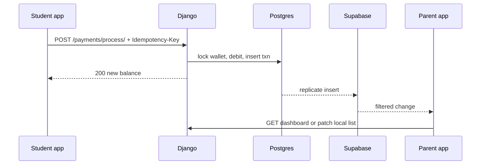

# Production operations — latency, traffic, errors, scale

This document is the **ops and reliability plan** for HapoPay in production. It is **not** the store-submission checklist.

| Doc | Scope |
|-----|--------|
| [`PRODUCTION_READINESS.md`](../PRODUCTION_READINESS.md) | App Store / Play blockers (signing, icons, legal) |
| [`PROD_NEXT_STEPS.md`](PROD_NEXT_STEPS.md) | Ordered ship runbook |
| **This file** | Money-safe API, traffic, errors, maintenance, workflows, client performance |

**Status:** planning only. Do not treat items below as implemented. Django lives outside this repo; the Flutter client must stay aligned with [`openapi.yaml`](openapi.yaml).

**Source of truth for money:** Django REST + Postgres. Supabase Realtime is a **read fan-out**, never the ledger.

---

## Contents

- [Current gaps (code vs production)](#current-gaps-code-vs-production)
- [Latency](#latency)
- [Heavy traffic](#heavy-traffic)
- [Error handling](#error-handling)
- [Maintenance](#maintenance)
- [Workflows](#workflows)
- [Scalability](#scalability)
- [User-facing performance](#user-facing-performance)
- [Contract changes (not coded yet)](#contract-changes-not-coded-yet)
- [Implementation priority](#implementation-priority)

---

## Current gaps (code vs production)

These exist in the Flutter repo today and must be treated as production risks.

| Gap | Where | Risk |
|-----|--------|------|
| `POST /payments/process/` has no idempotency key | [`openapi.yaml`](openapi.yaml), `StudentAccountRepository.processPayment` | Double debit if the user retries after a timeout |
| `RetryInterceptor` retries **all** methods on timeout (1s + 2s + 4s) | `lib/core/network/retry_interceptor.dart` | Replay of a successful pay whose HTTP response was lost |
| `CacheInterceptor` is implemented but **not mounted** on `DioClient` | `dio_client.dart` vs `cache_interceptor.dart` | No GET offline fallback despite docs |
| Parent dashboard **seeds fixture family** then swallows API errors | `parent_dashboard_provider.dart` | Parents can see fake balances in prod |
| Student id falls back to `'student_123'` | `student_account_provider.dart` | Wrong wallet if session is incomplete |
| Auth interceptor logs token injection in **all** builds | `auth_interceptor.dart` | JWT / request metadata in device logs |
| PIN screen can log the entered PIN | `pin_authentication.dart` | Credential leak |
| Realtime subscribes to **all** `transactions` rows | `supabase_realtime_service.dart` | Fan-out, battery, privacy if RLS is weak |
| `google_fonts` loads Outfit/DM Mono at runtime | multiple screens | First-paint delay, offline font failure |
| Unused `google_mlkit_*` in `pubspec.yaml` | `pubspec.yaml` | APK/IPA size, native load |
| Release CI builds **debug** APK without `.env.prod` | `.github/workflows/ci.yml` | Not a production artifact |
| No crash reporter | `pubspec.yaml` | Blind production failures |

Store identity (`com.example.hapopay`, debug signing) is covered in the store runbook, not here.

---

## Latency

**Hot path:** QR scan → PIN → `POST /payments/process/` → updated balance on screen.

Target: **p95 under ~800ms** on campus Wi‑Fi when Django is in the same region as the phones. Above ~2s, students tap Pay again — that is how you get duplicates unless the API is idempotent.

| Layer | Guidance |
|-------|----------|
| Client | Payment timeout **shorter** than the generic 30s Dio receive timeout (plan 8–12s). **One** attempt unless the server says “unknown — retry with the same idempotency key”. |
| API | Deploy near users; HTTP/2; keep-alive. Pay response should be **small** (balance + last txn), not the full history. |
| DB | Indexes on wallet/`student_id`, `created_at`, lock/limit fields. **Row-lock the wallet** inside one transaction. |
| Realtime | Do **not** wait on Supabase for the payer. Update the student UI from the **HTTP 200**. Parents can stream. |
| Fonts | Bundle Outfit / DM Mono. Runtime `google_fonts` adds latency and fails offline. |

`RetryInterceptor` backoff (1s + 2s + 4s) is acceptable for `GET /parent/dashboard/`. It is too slow **and** unsafe for pay.

Parent dashboard currently paints **catalog fixtures** immediately, then hydrates. That is fast for demos. In production it is a **wrong-family flash**. Use last-known-good cache plus a stale/offline banner, never Amara/Kwame seed data.

---

## Heavy traffic

Campus load is **spiky**, not average: lunch (11:30–13:30), Fridays, orientation week.

### Django / API (backend, outside this repo)

- Horizontal app servers behind a reverse proxy; not a single VM.
- **Connection pooling** (e.g. PgBouncer) so thousands of phones do not open thousands of Postgres connections.
- Rate limit login, token refresh, and pay (per user **and** per IP).
- Cache **read** endpoints (`GET` rewards, dashboard summary) with a short TTL. **Never cache pay.**
- Queue non-ledger work (email, FCM, analytics) so `/payments/process/` stays a short DB transaction.
- Autoscale on CPU **and** pay p95 latency, not request count alone.

### Supabase Realtime

Today every subscriber listens to table-wide `transactions` events and filters in Dart. That does not scale: N parents × all campus inserts.

- Filter at subscribe time (`student_id` or family ids).
- Enable **RLS** so clients cannot see other families.
- Prefer “invalidate dashboard” over shipping every row to every device if cost or battery becomes a problem.

### Flutter

- Keep a single long-lived `Dio` instance (already the intent of `dioClientProvider`).
- Coalesce dashboard / rewards / account fetches. Do not full-refetch the student account on every realtime tick.
- Paginate ledgers; [`GET /parent/ledger/`](api-reference.md) has no cursor in the spec today.

---

## Error handling

Typed mapping already exists (`ApiException`, `ErrorInterceptor`: 400/401/403/404/5xx and timeouts). Production needs **money semantics**, not only HTTP mapping.

### Payments (highest risk)

1. Client sends an `Idempotency-Key` (UUID **per user tap**) on `POST /payments/process/`.
2. Django stores key → result. The same key always returns the **same** debit (or the same decline).
3. **Do not retry POST on timeout** unless the replay uses that **same** key.
4. Distinguish:
   - **Declined** — HTTP 400 + `detail` (insufficient funds, lock, daily limit, bad QR). Show the message. Do not retry as a new payment.
   - **Unknown** — timeout, connection drop, 502/503 with no body. UI: “Checking payment…”, then `GET` account or a future `GET /payments/{id}`. **Never** “Try again” as a new POST.
   - **Success** — HTTP 200 with updated `StudentAccount`.
5. `ErrorInterceptor` maps timeouts to `NetworkException`. The pay UI must treat that as **uncertain**, not failed.

### Silent failures to remove before prod

- Parent `_loadFromApi` `catch (_) { }` keeps **demo family** if the API is down.
- `'student_123'` fallback must not ship in release.
- Strip or `kDebugMode`-gate auth/PIN loggers. Never log JWTs or PIN digits.

### Client UX

- Snackbars for ordinary network errors.
- **Blocking** copy for pay-unknown (cannot leave the user thinking they can safely tap again).
- Card lock / limit `PATCH`: optimistic UI only if the server can return 409/403 and the client rolls back.
- Force-logout on refresh failure is correct; pair with a session-expired screen that does not loop splash ↔ login.

### Observability

- Sentry or Firebase Crashlytics with **release** + hashed user id.
- Django: structured logs, request id, traces on `/payments/process/`.
- Alerts: pay error rate, 5xx, p95, idempotency collisions, JWT refresh failures.

---

## Maintenance

### Release

1. `dart analyze` + `flutter test` (CI already does this).
2. Release AAB/IPA with `--dart-define-from-file=.env.prod` and **`USE_MOCK_API=false`**.
3. Crash-free session gate before store promote.
4. Version = `pubspec.yaml` version + store build number; git tag.

Current CI `build-android` produces a **debug** APK **without** dart-defines. That is not a release pipeline.

### Environments

`dev` / `staging` / `prod` Django, each with a matching Supabase project if realtime is on. Staging must run **real** ledger semantics (sandbox money), not `MockInterceptor`.

### Config

Dart-defines are **compile-time**. Plan remote flags later (maintenance mode, minimum app version, kill-switch for QR pay) so pay can be disabled without a store review.

### Contracts

Keep [`openapi.yaml`](openapi.yaml) as the machine-readable contract. Mock interceptor, `tool/mock_api_server.dart`, Postman, and Django must stay in lockstep.

### Secrets and legal

Rotate JWT signing keys, Supabase keys, Play upload keystore. Never commit `.env.prod`. Host privacy policy and terms; define ledger retention and a support path for “I was charged twice.”

---

## Workflows

Correctness of the debit is **only** the Django transaction. Replication lag means parents can see a pay seconds late. That is acceptable if the student screen trusts HTTP.

| Workflow | Production requirement |
|----------|------------------------|
| Pay | Idempotent debit, PIN/biometric, clear decline reasons. Offline = hard fail (do not queue money on device). |
| Card lock | Immediate. Pay must re-read lock **inside** the same DB transaction. |
| Daily limit | Same-day spend vs `daily_limit`; timezone = campus TZ. |
| Rewards claim | Idempotent `achievement_id`. Django catalog must match `lib/features/student/models/rewards_catalog.dart`. |
| Ledger review | Flagged rows (`approved: false`) need a parent **action API**, not UI-only. |
| Support | Lookup by txn id, student id, time. Refund = **credit txn**, never delete history. |
| Incident | Feature flag disable pay; status page; retries only with the same idempotency key. |
| On-call | Runbooks: duplicate charge, JWT outage, Supabase replication lag. |

---

## Scalability

**Data model:** wallet row + **immutable** ledger. Never update balance without inserting a txn.

**Reads vs writes:** dashboards and rewards scale with cache + pagination. Pays scale with **how long the wallet row is locked**. Keep that transaction tiny.

**Realtime:** per-family channels, or poll with ETag if Realtime cost explodes.

**App updates:** Play / App Store plus a **force-upgrade** path when the pay protocol changes (new required headers).

This repository is the **client**. Most scale work is Django/Postgres. Flutter scale means: less chatter, smaller payloads, no global realtime, no retrying money POSTs as new requests.

A reactive backend (for example Convex) can later own live dashboards. It does not replace an atomic ledger unless that ledger is designed there on purpose. v1 source of truth stays Django.

---

## User-facing performance

### Startup

- Keep skipping `Supabase.initialize` when `SUPABASE_URL` is empty.
- Remove unused ML Kit packages before store builds.
- Tree-shake icons; `flutter build appbundle --analyze-size`.
- Splash only until session restore finishes; keep it short.

### Runtime

- **Stale-while-revalidate** for GETs once cache is actually mounted: show last payload, banner if offline.
- Do not replace the whole student screen with `AsyncLoading` on every refresh (`StudentAccount.refresh` today). Keep previous `AsyncData` and overlay.
- Lists: `ListView.builder`, avoid rebuilding charts on every realtime tick.
- Assets: sized WebP/SVG; no huge PNGs.
- QR: start `mobile_scanner` only on the pay route; dispose the camera on leave (battery and heat).
- Parse large ledgers off the UI isolate if pages grow.
- Profile **low-end Android** (common in student markets), not only flagship devices.

### Network UX

- Connectivity-aware: disable Pay when offline.
- Parallelize independent GETs after login (account + rewards) with a small concurrency cap.
- Prefetch student account after successful login.

### Accessibility / campus

- Large pay targets; high contrast; do not use color alone for declined vs success.
- Assume 2G / flaky Wi‑Fi: small payloads, bundled fonts.

---

## Contract changes (not coded yet)

When implementation starts, these belong in [`openapi.yaml`](openapi.yaml) and Django **before** the Flutter retry policy changes.

1. **`Idempotency-Key` header** (or body field) on `POST /payments/process/` and `POST /rewards/{id}/claim/`.
2. **Pay-unknown recovery:** `GET /payments/{id}` or “latest payment for this key” so the client can resolve timeouts without a second debit.
3. **Pagination** on `GET /parent/ledger/` and student `transactions` (`cursor` + `limit`).
4. **Parent review actions** for flagged ledger rows (approve / reject), if that product path ships.
5. **Error shape:** keep `{ "detail": "..." }` for declines; add a stable `code` (`insufficient_funds`, `card_locked`, `daily_limit`, `duplicate_idempotency`) so the UI does not parse English strings.

Until those exist, the client must still **stop retrying POST on timeout**.

---

## Implementation priority

Do this **before** store polish if the app will move real money.

1. Idempotent payments + never auto-retry POST without the same key.
2. Stop showing fixture dashboards on API failure; last cache or error.
3. Remove `'student_123'` fallback in release.
4. Crash reporting + Django request ids.
5. Mount GET-only cache with TTL; never cache pay or claim.
6. Shorter pay timeouts; keep longer timeouts for reports.
7. Realtime filter + RLS; refetch less.
8. Paginate transactions.
9. Bundle fonts; drop unused ML Kit.
10. Rate limits, pooling, pay p95 alerts on Django; then release signing and `.env.prod` (store runbook).

Icons, listings, and privacy policy **block store submit**. They do not keep the ledger correct. Get the money path right first, then [`PROD_NEXT_STEPS.md`](PROD_NEXT_STEPS.md).
