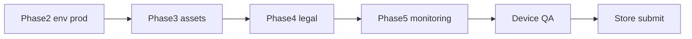

# Production Next Steps HapoPay Flutter

Ordered runbook to ship v1.0.0 to App Store and Google Play.
See also [`PRODUCTION_READINESS.md`](../PRODUCTION_READINESS.md) for the full checklist status.

For latency, traffic, payment safety, Django scale, and client performance (planning, not yet coded), see [`PRODUCTION_OPERATIONS.md`](PRODUCTION_OPERATIONS.md).

---

## Phase 1:  Identity & signing

### Android (wired in app)
- [x] `applicationId` / `namespace` → `com.hapopay.hapoPay`
- [x] Release signing loads `android/key.properties` + upload keystore (falls back to debug with a Gradle warning if missing)
- [x] Confirm `android/key.properties` and `android/keys/upload-keystore.jks` exist locally (gitignored) — regenerate with `./tool/generate_android_keystore.sh` (**replace the local-dev passwords before Play upload**)
- [x] Release signing verified via `./gradlew :app:signingReport` (release → `android/keys/upload-keystore.jks`). Owner: also run AAB once:

```bash
flutter build appbundle --release --dart-define-from-file=.env.prod
```

### iOS (owner)
- [ ] Apple Developer Program enrollment
- [x] App ID / bundle ID: `com.hapopay.hapoPay` (already set in Xcode project)
- [ ] Distribution certificate + provisioning profile
- [ ] Set `DEVELOPMENT_TEAM` in Xcode (or via CI secrets used by `.github/workflows/ios-build.yml`)
- [ ] Verify: `flutter build ipa --release --dart-define-from-file=.env.prod`

Owner notes: do **not** use Makefile `ios-archive` (legacy JTC team/bundle). After Team ID is set, archive from Xcode or the signed `ios-build.yml` workflow.

---

## Phase 2: Production environment

Create `.env.prod` (never commit):

```
SUPABASE_URL=https://your-prod.supabase.co
SUPABASE_ANON_KEY=your-prod-anon-key
API_BASE_URL=https://api.yourdomain.com/api
USE_MOCK_API=false
SENTRY_DSN=https://...@o....ingest.sentry.io/...
```

- [ ] Fill real prod values in local `.env.prod` (template present; replace placeholders)
- [ ] Confirm Django `CORS` / `ALLOWED_HOSTS` include store / web domains *(deferred — owner / backend)*
- [ ] Confirm Supabase realtime replication for prod tables — see checklist below
- [x] Local / CI release builds must **not** set `USE_MOCK_API=true` (`EnvConfig.assertReleaseSafe` + release workflow force `false`)

### Supabase replication (owner — prod project)

1. Open the **production** Supabase project → **Database → Replication**.
2. Enable replication for tables the app listens on (at least `public.transactions`).
3. Confirm RLS so clients cannot read other families’ rows.
4. Smoke-test: parent live feed updates after a student pay on prod.

Dev / mock UI:

```bash
flutter run --dart-define-from-file=.env.dev
# .env.dev should include USE_MOCK_API=true
```

---

## Phase 3: Store assets

- [ ] Branded Android adaptive icons + iOS AppIcon (1024×1024 source)
- [ ] Splash / launch screens (Android `launch_background.xml`, iOS LaunchScreen)
- [ ] Play Store feature graphic (1024×500)
- [ ] App Store screenshots (6.7", 6.5", 5.5", iPad Pro)
- [ ] Replace `.gitkeep` placeholders under `assets/images/` and `assets/icons/`

---

## Phase 4: Legal & store listings

- [ ] Host Privacy Policy URL (required by both stores) — content checklist: [`legal/PRIVACY_POLICY_CHECKLIST.md`](legal/PRIVACY_POLICY_CHECKLIST.md)
- [ ] Host Terms of Service — content checklist: [`legal/TERMS_OF_SERVICE_CHECKLIST.md`](legal/TERMS_OF_SERVICE_CHECKLIST.md)
- [x] Short + long store descriptions, keywords — [`store/LISTING_COPY.md`](store/LISTING_COPY.md)
- [x] Content rating / age rating questionnaire **notes** (Play / IARC) — [`store/CONTENT_RATING_NOTES.md`](store/CONTENT_RATING_NOTES.md)
- [x] Play Console Data safety form **draft** — [`store/PLAY_DATA_SAFETY.md`](store/PLAY_DATA_SAFETY.md) (paste into console)
- [ ] App Store Connect: pricing, category, age rating *(deferred this pass)*

---

## Phase 5: Monitoring & release CI

- [x] Integrate Sentry (`sentry_flutter`; skip init when `SENTRY_DSN` empty)
- [x] Add GitHub Actions jobs for release AAB / IPA with `.env.prod` — [`.github/workflows/release.yml`](../.github/workflows/release.yml) (tag `v*` or workflow_dispatch)
- [x] Version bump automation — `dart run tool/bump_version.dart <build|patch|minor|major>`

Required GitHub secrets for release workflow: `API_BASE_URL`, `SUPABASE_URL`, `SUPABASE_ANON_KEY`, `SENTRY_DSN`, `ANDROID_KEYSTORE_BASE64`, `ANDROID_KEYSTORE_PASSWORD`, `ANDROID_KEY_PASSWORD`, `ANDROID_KEY_ALIAS`.

Signed iOS IPA remains on [`ios-build.yml`](../.github/workflows/ios-build.yml) once Apple team assets exist; `release.yml` ships unsigned iOS release artifacts.

---

## Phase 6:  Device QA checklist



Run on physical devices before submission:

- [ ] Login / register / biometric unlock
- [ ] Parent: spending limits, card lock, live feed
- [ ] Student: QR pay / scan flow
- [ ] Rewards: tier ladder, streak panel, claim achievement (light + dark)
- [ ] Offline / error snackbars behave; no mock interceptor in release
- [ ] `flutter analyze` clean; test suite green

---

## Backend parity (rewards)

Django `/api/rewards/` should match the client catalog in
`lib/features/student/models/rewards_catalog.dart`:

| Tier | Points |
|------|--------|
| Bronze | 0–149 |
| Silver | 150–499 |
| Gold | 500–999 |
| Platinum | 1000+ |

Achievement IDs: `first_pay`, `qr_rookie`, `qr_pro`, `campus_champ`,
`budget_3`, `week_warrior`, `month_master`, `smart_spender`, `big_buffer`.

---

## Secrets hygiene

Never commit: `key.properties`, `*.jks`, `.env.prod`, `.env.dev`, provisioning profiles.
Keep `.env.example` as the only committed env template.
